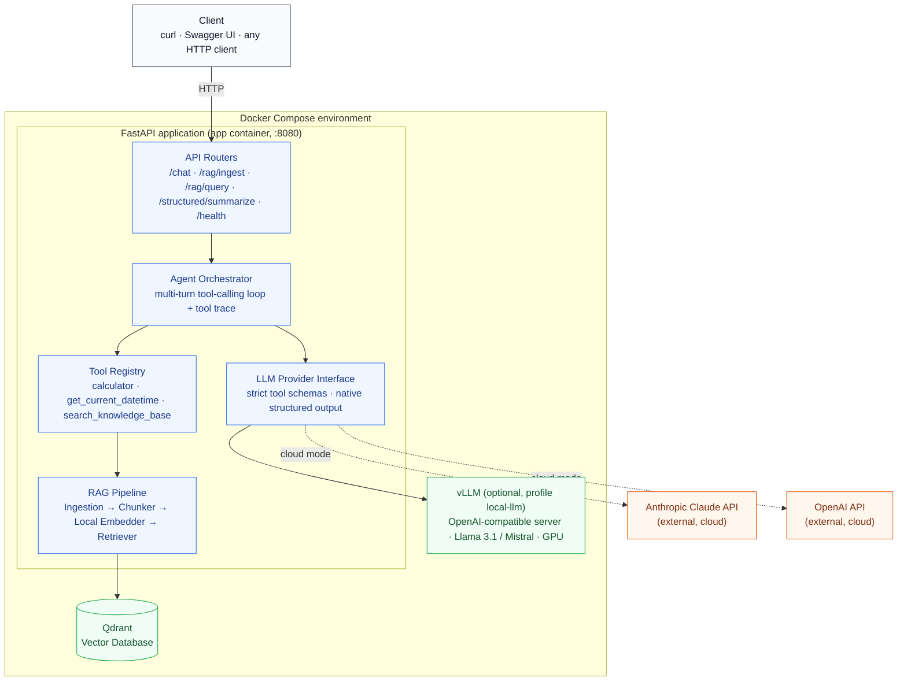

# AI Assistant — RAG + Tool Calling + Structured Output

A provider-agnostic LLM assistant: point it at Anthropic Claude or OpenAI in
the cloud, or swap in a self-hosted open-source model served by vLLM,
without touching application code. Built with FastAPI, Qdrant, and
sentence-transformers, and packaged to run with a single `docker compose up`.

## What's here

| Requirement | Implementation |
|---|---|
| LLM integration (major provider) | Anthropic Claude (default) and OpenAI, behind one interface — `app/llm/` |
| Prompt engineering | System prompt in `app/agent/orchestrator.py`; temperature/top_p tuned per endpoint, see [Prompt engineering](#prompt-engineering) |
| Structured output | Native JSON-schema constrained decoding, not a prompting trick — `POST /structured/summarize` |
| Tool calling | Multi-turn agent loop, 3 tools, one of which is RAG retrieval itself — `app/agent/orchestrator.py` |
| RAG pipeline | Chunking → local embeddings → Qdrant, exposed both as a callable tool and a classic retrieve-then-generate endpoint — `app/rag/` |
| Local deployment (vLLM) | `docker compose --profile local-llm up`, serves Llama 3.1 8B Instruct by default |
| Containerization | Multi-stage `Dockerfile` + `docker-compose.yml` |

Every part of this was actually run and tested while building it (unit
tests, live dependency installs, a real FastAPI app boot) — not just
written from memory. See [Testing](#testing) to reproduce that.

## Architecture



A standalone image version is at [`docs/architecture.svg`](docs/architecture.svg)
(source: [`docs/architecture.mmd`](docs/architecture.mmd)).

**The design decision that ties two requirements together:**
`OpenAICompatibleProvider` (`app/llm/openai_compatible_provider.py`) is used
for *both* real OpenAI **and** local vLLM. vLLM's server implements the same
`/v1/chat/completions` wire format OpenAI does, so switching between them is
a one-line config change (`base_url`), not a second client implementation.

## Project structure

```
app/
├── main.py                    # FastAPI app, lifespan-managed startup
├── config.py                  # All settings, read from env / .env
├── dependencies.py            # FastAPI DI accessors (app.state -> routes)
├── llm/
│   ├── base.py                 # LLMProvider interface, ToolDefinition, strict_json_schema
│   ├── anthropic_provider.py   # Claude: native tool use + native structured outputs
│   ├── openai_compatible_provider.py  # OpenAI cloud AND local vLLM (same class)
│   └── factory.py              # LLM_PROVIDER -> concrete provider
├── agent/
│   └── orchestrator.py         # The tool-calling loop
├── tools/
│   ├── registry.py             # Tool registration/dispatch
│   ├── builtin_tools.py        # calculator (safe, no eval()), get_current_datetime
│   └── knowledge_base_tool.py  # search_knowledge_base -- RAG exposed as a tool
├── rag/
│   ├── chunking.py             # Sentence-aware recursive chunking with overlap
│   ├── embeddings.py           # Local sentence-transformers model
│   ├── vector_store.py         # Qdrant wrapper (VectorStore interface)
│   ├── ingestion.py            # Read -> chunk -> embed -> upsert
│   └── retriever.py            # Query-time retrieval
├── schemas/                    # Pydantic request/response models
└── api/                        # Route handlers: chat, rag, structured, health
scripts/ingest_sample_docs.py   # CLI bulk ingestion
sample_docs/                    # A doc about this project, for testing RAG immediately
tests/                          # Unit tests -- no live services needed, see Testing
docs/architecture.{svg,mmd}
Dockerfile
docker-compose.yml
requirements.txt / requirements-dev.txt
.env.example
Makefile
```

## Getting started

### Prerequisites

- Docker + Docker Compose v2
- An Anthropic or OpenAI API key, **or** an NVIDIA GPU with the
  [NVIDIA Container Toolkit](https://docs.nvidia.com/datacenter/cloud-native/container-toolkit/latest/install-guide.html)
  installed for the local vLLM path

### Quickest path: cloud provider

```bash
cp .env.example .env
# edit .env: set ANTHROPIC_API_KEY (default provider), or set
# LLM_PROVIDER=openai and OPENAI_API_KEY instead

docker compose up --build
```

Wait for the health check to go green, then ingest the bundled sample
document and ask about it:

```bash
curl -s http://localhost:8080/health | python3 -m json.tool

docker compose exec app python scripts/ingest_sample_docs.py sample_docs

curl -s http://localhost:8080/chat -H 'Content-Type: application/json' -d '{
  "messages": [{"role": "user", "content": "What vector database does this project use?"}]
}' | python3 -m json.tool
```

Or skip curl entirely and use the interactive API docs at
`http://localhost:8080/docs`.

### Fully local path: no cloud API key

Requires an NVIDIA GPU -- vLLM is GPU-first (see [Notes & limitations](#notes--limitations)
for CPU alternatives).

```bash
cp .env.example .env
# edit .env: LLM_PROVIDER=local

docker compose --profile local-llm up --build
```

First start downloads the model (Llama 3.1 8B Instruct by default, ~16 GB)
and can take a while depending on your connection; it's cached in a named
volume afterward. Everything else -- ingestion, `/chat`, `/rag/query`,
`/structured/summarize` -- works identically to the cloud path.

`make up` / `make up-local` / `make ingest` / `make test` wrap the commands
above; run `make` with no target to see the full list.

## Configuration

Every setting lives in `app/config.py` and is overridable via `.env` /
environment variables:

| Variable | Default | Notes |
|---|---|---|
| `LLM_PROVIDER` | `anthropic` | `anthropic` \| `openai` \| `local` |
| `ANTHROPIC_API_KEY` / `ANTHROPIC_MODEL` | — / `claude-sonnet-5` | |
| `OPENAI_API_KEY` / `OPENAI_MODEL` | — / `gpt-4o-mini` | |
| `VLLM_BASE_URL` / `VLLM_MODEL` | `http://vllm:8000/v1` / `meta-llama/Meta-Llama-3.1-8B-Instruct` | |
| `TEMPERATURE` / `TOP_P` | `0.7` / `1.0` | Defaults for `/chat`; overridable per request |
| `MAX_TOOL_ITERATIONS` | `5` | Safety cap on the tool-calling loop |
| `QDRANT_URL` / `QDRANT_COLLECTION` | `http://qdrant:6333` / `knowledge_base` | |
| `EMBEDDING_MODEL` | `BAAI/bge-small-en-v1.5` | Local, 384-dim, runs on CPU |
| `CHUNK_SIZE` / `CHUNK_OVERLAP` | `800` / `120` | Characters, not tokens -- see `app/rag/chunking.py` |
| `TOP_K` | `4` | Default retrieval depth |

## API reference

### `POST /chat` — the agentic assistant

Runs the full tool-calling loop: the model decides per-turn whether to use
`search_knowledge_base`, `calculator`, `get_current_datetime`, some
combination, or none at all.

```bash
curl -s http://localhost:8080/chat -H 'Content-Type: application/json' -d '{
  "messages": [{"role": "user", "content": "What is 12% of 850, and what embedding model does this project use?"}]
}'
```

Illustrative response shape (the `tool_trace` is what makes tool calling
*observable* rather than a black box):

```json
{
  "answer": "12% of 850 is 102. This project uses BAAI/bge-small-en-v1.5 for local embeddings.",
  "tool_trace": [
    {"tool": "calculator", "arguments": {"expression": "850 * 0.12"}, "result": "102.0", "is_error": false},
    {"tool": "search_knowledge_base", "arguments": {"query": "embedding model", "top_k": 4}, "result": "[source: about_this_assistant.md | relevance=0.71]\n...", "is_error": false}
  ],
  "iterations": 2
}
```

Optional fields: `"provider"` (`"anthropic"|"openai"|"local"`, overrides
`LLM_PROVIDER` for this one request), `"temperature"`, `"top_p"`.

### `POST /rag/ingest`

```bash
curl -s http://localhost:8080/rag/ingest -F "file=@sample_docs/about_this_assistant.md"
# {"filename": "about_this_assistant.md", "chunks_ingested": 4}
```

Accepts `.txt`, `.md`, `.pdf`.

### `POST /rag/query` — classic retrieve-then-generate

The non-agentic counterpart to `search_knowledge_base`-as-a-tool: always
retrieves, then answers once, grounded only in what was retrieved.

```bash
curl -s http://localhost:8080/rag/query -H 'Content-Type: application/json' -d '{
  "query": "How does local model serving work in this project?",
  "top_k": 3
}'
```

### `POST /structured/summarize` — structured output demo

```bash
curl -s http://localhost:8080/structured/summarize -H 'Content-Type: application/json' -d '{
  "text": "Qdrant is an open-source vector database written in Rust. It exposes both a REST and a gRPC API and is commonly deployed via Docker for local development."
}'
```

```json
{
  "title": "Qdrant Vector Database Overview",
  "key_points": [
    "Qdrant is open-source and written in Rust",
    "It exposes both REST and gRPC APIs",
    "Commonly deployed via Docker for local development"
  ],
  "sentiment": "neutral",
  "word_count_estimate": 28
}
```

This is guaranteed-valid JSON from constrained decoding, then re-validated
through the same Pydantic model on the way out.

### `GET /health`

Reports resolved configuration and whether the vector store came up; makes
no live calls to the LLM provider or Qdrant, so it's cheap to poll.

## How tool calling works

`app/agent/orchestrator.py`'s loop, in short: send the conversation + tool
definitions to the model → if it replies with plain text, return it → if it
replies with one or more tool calls, execute each one, append the call *and*
its result to the conversation, and go back to step one. Capped at
`MAX_TOOL_ITERATIONS` round-trips so a model stuck calling the same tool
repeatedly can't loop forever.

Every tool schema sets `additionalProperties: false` and lists every
property as required (`app.llm.base.strict_json_schema`), which lets
Anthropic's and OpenAI's *strict* tool-use modes guarantee the arguments
that come back validate against the schema -- no more `expected int, got
"3"` bugs downstream.

Tool execution errors never crash the request (`ToolRegistry.call` catches
everything and returns `(message, is_error=True)`); they're fed back to the
model as a failed tool result, the same way a real production agent would
handle it, so the model can react instead of the whole call blowing up.

## How RAG works

`app/rag/chunking.py` implements sentence-aware "recursive" chunking:
pack whole sentences up to `CHUNK_SIZE` characters, then start the next
chunk with `CHUNK_OVERLAP` characters carried over from the previous one's
tail, so facts near a chunk boundary aren't invisible to retrieval. An
oversized single sentence is hard-split as a last resort. Character-based
sizing (not token-based) is a deliberate simplicity trade-off with zero
extra dependencies -- see the docstring for how to swap in a tokenizer if
you need token-exact budgets.

Embeddings are local (`sentence-transformers`, default
`BAAI/bge-small-en-v1.5`), so ingestion works fully offline once the model
is cached -- no embeddings API key needed. Vectors are stored in Qdrant with
cosine similarity.

**Retrieval is exposed to the model as a tool (`search_knowledge_base`),
not force-injected into every prompt.** `/chat`'s agent decides, per
question, whether it actually needs the knowledge base -- a greeting or a
math question shouldn't burn a retrieval call. `POST /rag/query` still
offers the classic always-retrieve-then-generate pattern for comparison, at
a lower, fixed temperature (`0.2`) chosen for faithfulness over variety.

## How structured output works

`LLMProvider.generate_structured` uses each backend's *native*
constrained-decoding structured-output feature -- not the older "define a
fake tool and hope the model calls it with valid JSON" workaround:

- **Anthropic**: `output_config.format={"type": "json_schema", "schema": ...}` (GA in 2026).
- **OpenAI / vLLM**: `response_format={"type": "json_schema", "json_schema": {..., "strict": true}}`.

Both guarantee the response is schema-valid JSON at generation time, not
just "usually valid, retry on failure." `DocumentSummary`
(`app/schemas/structured.py`) is deliberately a flat model with no nested
`BaseModel`s, so `model_json_schema()`'s output needs no `$defs`/`$ref`
resolution before being handed to the provider. A deeply nested schema would
need that resolved recursively -- `strict_json_schema()` in
`app/llm/base.py` only handles the flat, single-level case this project
actually uses.

## Prompt engineering

The system prompt (`DEFAULT_SYSTEM_PROMPT` in `app/agent/orchestrator.py`)
does three jobs: tells the model which tool to reach for and when, tells it
to cite sources when it uses retrieved context, and explicitly tells it to
admit uncertainty rather than fabricate an answer when a tool comes back
empty.

Temperature/top_p are not one-size-fits-all across the app -- they're tuned
per task:

| Endpoint | Temperature | Why |
|---|---|---|
| `/chat` | `0.7` (default, overridable) | General conversation benefits from some variety |
| `/rag/query` | `0.2` (fixed) | Faithfulness to retrieved text matters more than phrasing variety |
| `/structured/summarize` | `0.0` (fixed) | Extraction/classification wants determinism, not creativity |

`/chat` also accepts per-request `temperature`/`top_p` overrides, and a
per-request `provider` override, so you can compare, say, Claude against a
locally hosted Llama 3.1 answering the exact same prompt without restarting
anything.

## Testing

The unit test suite (23 tests, `tests/`) deliberately needs **no** live
Qdrant, no LLM API key, and no network access -- it tests pure logic:
chunking edge cases, the calculator's refusal to execute anything beyond
arithmetic, the tool registry's error handling, and the agent loop's control
flow against a scripted fake `LLMProvider` (verifying the actual tool-call
→ result → next-turn mechanics, not just that a function exists).

```bash
make test
# or: pip install -r requirements-dev.txt && pytest -v
```

Live integration testing (a real Qdrant, a real model) is intentionally out
of scope for this suite -- see [Notes & limitations](#notes--limitations).

## Extending to another provider (Gemini, Bedrock)

Implement `LLMProvider` (`app/llm/base.py`: `generate()` and
`generate_structured()`), register it in `app/llm/factory.py`'s `_build()`,
and add its settings to `app/config.py`. Nothing else in the codebase
imports a concrete provider class directly, so nothing else needs to
change.

## Notes & limitations

Written honestly, not glossed over:

- **No auth/rate limiting.** This is an assistant service, not a
  multi-tenant API product; add an API-key or OAuth layer in front of it
  (e.g. an API gateway) before exposing it beyond localhost.
- **vLLM is GPU-first.** For CPU-only local inference, look at
  [Ollama](https://ollama.com) or `llama.cpp` instead -- both also expose
  OpenAI-compatible endpoints, so `OpenAICompatibleProvider` should work
  against them with just a `base_url`/model name change, though this hasn't
  been tested against those specific servers.
- **No streaming.** Every endpoint returns a complete response; adding
  Server-Sent Events for `/chat` is a natural next step and mainly touches
  `AgentOrchestrator.run` and the provider `generate()` methods.
- **No reranking / hybrid search.** Retrieval is single-stage cosine
  similarity. A cross-encoder reranking pass or BM25+vector hybrid search
  would improve precision on larger corpora.
- **Startup is bounded but not instant.** RAG-stack initialization
  (embedding model + Qdrant) is capped at 45 seconds
  (`RAG_STARTUP_TIMEOUT_SECONDS` in `app/main.py`) and degrades gracefully
  rather than crashing the app if it can't finish in time -- but heavy ML
  imports (`torch`, via `sentence-transformers`) do add real, one-time
  process startup latency, independent of network conditions.
- **Structured-output and strict-tool-use model support varies.** Check
  current provider docs before switching `ANTHROPIC_MODEL` /
  `OPENAI_MODEL` away from the defaults.
- **Single-node Qdrant, no auth.** Fine for local dev; a production
  deployment should enable Qdrant API-key auth and consider its clustering
  options for scale.

## License

MIT -- see [`LICENSE`](LICENSE).
