# AI Assistant — RAG + Tool Calling + Structured Output

A provider-agnostic LLM assistant: point it at Anthropic Claude or OpenAI in
the cloud, or swap in a self-hosted open-source model served by vLLM,
without touching application code. Built with FastAPI, Qdrant, and
sentence-transformers, and packaged to run with a single `docker compose up`.

## What's here

| Requirement | Implementation |
|---|---|
| LLM integration (major provider) | Anthropic Claude (default) and OpenAI, behind one interface — `app/llm/` |
| Prompt engineering | System prompt in `app/agent/orchestrator.py`; temperature/top_p tuned per endpoint, see [Prompt engineering](#prompt-engineering) |
| Structured output | Native JSON-schema constrained decoding, not a prompting trick — `POST /structured/summarize` |
| Tool calling | Multi-turn agent loop, 3 tools, one of which is RAG retrieval itself — `app/agent/orchestrator.py` |
| Verified research | Multi-agent supervisor loop (`POST /research`): Research + Verifier, Skills progressive disclosure, custom eval harness — see [Verified research](#verified-research) |
| RAG pipeline | Chunking → local embeddings → Qdrant, exposed both as a callable tool and a classic retrieve-then-generate endpoint — `app/rag/` |
| Local deployment (vLLM) | `docker compose --profile local-llm up`, serves Llama 3.1 8B Instruct by default |
| Containerization | Multi-stage `Dockerfile` + `docker-compose.yml` |

Every part of this was actually run and tested while building it (unit
tests, live dependency installs, a real FastAPI app boot) — not just
written from memory. See [Testing](#testing) to reproduce that.

## Architecture

```mermaid
flowchart TB
    Client["Client<br/>curl · Swagger UI · any HTTP client"]

    subgraph Compose["Docker Compose environment"]
        direction TB

        subgraph FastAPIApp["FastAPI application (app container, :8080)"]
            direction TB
            Routers["API Routers<br/>/chat · /research · /rag/* · /structured/summarize · /health"]

            subgraph Classic["Classic path (unchanged)"]
                Orchestrator["Agent Orchestrator<br/>multi-turn tool loop + tool trace"]
                ChatTools["Tool Registry<br/>calculator · datetime · search_knowledge_base"]
            end

            subgraph ResearchPath["Verified research path"]
                Supervisor["Supervisor<br/>budgets · stop reasons · token rollup"]
                Research["Research Agent<br/>search · load_skill · evidence notes · clarify"]
                Verifier["Verifier Agent<br/>draft + EvidenceNotes only"]
                Skill["skills/verified_research<br/>progressive disclosure"]
                Notes["EvidenceNotes<br/>external structured notes"]
            end

            LLMIface["LLM Provider Interface<br/>strict tools · structured output · usage"]
            RAG["RAG Pipeline<br/>Ingest → Chunk → Embed → Retrieve"]

            Routers --> Orchestrator
            Routers --> Supervisor
            Orchestrator --> ChatTools
            Orchestrator --> LLMIface
            ChatTools --> RAG

            Supervisor --> Research
            Supervisor --> Verifier
            Research --> Skill
            Research --> Notes
            Verifier --> Notes
            Research --> LLMIface
            Verifier --> LLMIface
            Research --> RAG
        end

        Qdrant[("Qdrant<br/>Vector Database")]
        VLLM["vLLM (optional, profile local-llm)<br/>OpenAI-compatible · Llama 3.1 / Mistral"]

        RAG --> Qdrant
        LLMIface --> VLLM
    end

    Anthropic["Anthropic Claude API<br/>(external, cloud)"]
    OpenAI["OpenAI API<br/>(external, cloud)"]

    subgraph MLOpsTrack["MLOps tracking"]
        MLflowBox["MLflow params / metrics / step traces"]
        EvidentlyBox["Evidently golden regression"]
        AirflowBox["Airflow DAG / make airflow-dry-run"]
    end

    Client -- HTTP --> Routers
    LLMIface -. cloud mode .-> Anthropic
    LLMIface -. cloud mode .-> OpenAI
    Supervisor --> MLflowBox
    Supervisor --> EvidentlyBox
    AirflowBox --> EvidentlyBox
    AirflowBox --> MLflowBox

    classDef app fill:#eff6ff,stroke:#2563eb,color:#1e3a8a;
    classDef container fill:#f0fdf4,stroke:#16a34a,color:#14532d;
    classDef cloud fill:#fff7ed,stroke:#ea580c,color:#7c2d12;
    classDef client fill:#f8fafc,stroke:#334155,color:#0f172a;
    classDef research fill:#f5f3ff,stroke:#7c3aed,color:#4c1d95;
    classDef mlops fill:#ecfeff,stroke:#0891b2,color:#155e75;

    class Client client;
    class Routers,Orchestrator,ChatTools,LLMIface,RAG app;
    class Supervisor,Research,Verifier,Skill,Notes research;
    class Qdrant,VLLM container;
    class Anthropic,OpenAI cloud;
    class MLflowBox,EvidentlyBox,AirflowBox mlops;
```



A standalone image version is at [`docs/architecture.svg`](docs/architecture.svg)
(Mermaid source: [`docs/architecture.md`](docs/architecture.md)). Build plan: [`docs/SPECS.md`](docs/SPECS.md).

**The design decision that ties two requirements together:**
`OpenAICompatibleProvider` (`app/llm/openai_compatible_provider.py`) is used
for *both* real OpenAI **and** local vLLM. vLLM's server implements the same
`/v1/chat/completions` wire format OpenAI does, so switching between them is
a one-line config change (`base_url`), not a second client implementation.

## Project structure

```
app/
├── main.py                    # FastAPI app, lifespan-managed startup
├── config.py                  # All settings, read from env / .env
├── dependencies.py            # FastAPI DI accessors (app.state -> routes)
├── llm/
│   ├── base.py                 # LLMProvider interface, ToolDefinition, strict_json_schema
│   ├── anthropic_provider.py   # Claude: native tool use + native structured outputs
│   ├── openai_compatible_provider.py  # OpenAI cloud AND local vLLM (same class)
│   └── factory.py              # LLM_PROVIDER -> concrete provider
├── agent/
│   ├── orchestrator.py         # Classic /chat tool-calling loop
│   ├── supervisor.py           # /research: research ↔ verify budgets + stop reasons
│   ├── research_agent.py       # Multi-iteration research with tools + evidence notes
│   ├── verifier_agent.py       # Separate-context claim check against notes
│   ├── evidence_notes.py       # Structured EvidenceNotes models
│   └── context_budget.py       # Tool-result capping / message compaction
├── tools/
│   ├── registry.py             # Tool registration/dispatch
│   ├── builtin_tools.py        # calculator (safe, no eval()), get_current_datetime
│   ├── knowledge_base_tool.py  # search_knowledge_base -- RAG as a tool (+ failure inject)
│   ├── skill_tool.py           # load_skill progressive disclosure
│   └── research_tools.py       # update_evidence_notes, ask_clarification
├── rag/
│   ├── chunking.py             # Sentence-aware recursive chunking with overlap
│   ├── embeddings.py           # Local sentence-transformers model
│   ├── vector_store.py         # Qdrant wrapper (VectorStore interface)
│   ├── ingestion.py            # Read -> chunk -> embed -> upsert
│   └── retriever.py            # Query-time retrieval
├── schemas/                    # Pydantic request/response models (incl. research)
└── api/                        # chat, research, rag, structured, health
skills/verified_research/       # Runtime Skill loaded by the research agent
prompts/                        # Versioned research system prompts (prompt_v1…)
mlops/                          # MLflow + Evidently + Airflow DAG / dry-run
eval/                           # Harness, cases.yaml, golden_set.yaml, report.md
scripts/ingest_sample_docs.py   # CLI bulk ingestion
sample_docs/                    # Sample corpus for RAG / research demos
tests/                          # Unit tests -- no live services needed, see Testing
docs/architecture.{svg,md}      # Diagram (+ SPECS.md build plan)
Dockerfile
docker-compose.yml
pyproject.toml / uv.lock         # Locked env (uv); see [Environment & Reproducibility (uv)](#environment--reproducibility-uv)
.env.example
Makefile
```

## Environment & Reproducibility (uv)

Dependencies are declared in [`pyproject.toml`](pyproject.toml) and **fully locked** in
[`uv.lock`](uv.lock). Without a lockfile, local `pip install` and Docker could resolve
different transitive versions of FastAPI / Pydantic / qdrant-client /
sentence-transformers, which silently changes RAG and tool-loop behavior and breaks
later MLflow run comparability.

**One-command local setup:**

```bash
uv sync --extra dev
uv run pytest -v
# later: uv run python -m eval.harness
```

Docker uses the **same** lockfile: the image builder runs `uv sync --frozen` (no
`uv export` → pip). Optional extras: `--extra dev` (pytest, PyYAML), `--extra mlops`
(mlflow, evidently — used for experiments and regression).

Install [uv](https://docs.astral.sh/uv/) if you do not have it yet.

## Experiment tracking (MLflow)

There is no trained model; experiments version **research system prompts** and
retrieval/agent config. Each matrix row logs harness metrics plus **full step
traces** (JSONL artifacts) to MLflow.

```bash
make mlflow-experiment
# or: uv sync --extra mlops --extra dev && uv run --extra mlops python -m mlops.experiment_runner
```

| What varied | Measured | Winner / trade-off |
|---|---|---|
| `prompt_v1` → `v2` → `v3` plus `TOP_K` / `TOOL_RESULT_MAX_CHARS` ([`mlops/experiment_matrix.yaml`](mlops/experiment_matrix.yaml)) | Completion rate, tool-call correctness, mean iterations/tokens, failure counts | **`prompt_v3`** — keeps v2 draft-naming + `TOP_K=6`, tightens tool-result cap for leaner context (less raw chunk text vs v1 defaults) |

Diagnoses: [`prompts/CHANGELOG.md`](prompts/CHANGELOG.md). Comparison export:
[`mlops/reports/mlflow_comparison.md`](mlops/reports/mlflow_comparison.md). UI:
`MLFLOW_TRACKING_URI=./mlruns MLFLOW_ALLOW_FILE_STORE=true uv run --extra mlops mlflow ui`.

## Monitoring & drift (Evidently)

Fixed **reference** answers live in [`eval/golden_set.yaml`](eval/golden_set.yaml)
(approved `prompt_v3`-aligned baselines). **Current** answers come from the same
scripted research scenarios under the candidate prompt/config.

| Check | What it catches |
|---|---|
| Reference correctness | Current answer loses or contradicts golden facts |
| Refusal / no-fabrication | On KB failure (`kb_unavailable_recognized`), answer must acknowledge unavailability — not invent corpus claims |

```bash
make evidently-regression
# deliberate regression demo (should fail promotion):
uv run --extra mlops python -m mlops.evidently_regression --bad-prompt-demo --prompt-version prompt_bad
# live LLM judges (needs API key):
uv run --extra mlops python -m mlops.evidently_regression --judge-mode llm --prompt-version prompt_v3
```

**Metrics / promotion:** `pct_tests_passed` (and per-check rates) log to MLflow;
tag `promoted=true` only if `pct_tests_passed >= EVIDENTLY_PASS_THRESHOLD` (default
`0.8`). Below threshold → do not promote that prompt version.

**Report takeaway (scripted `prompt_v3`):**
[`mlops/reports/evidently_prompt_v3.html`](mlops/reports/evidently_prompt_v3.html)
+ notes — 100% checks passed, suite `INCORRECT`/`FABRICATED` counts = 0, promoted.
Judge sanity: scripted heuristics match human reading of golden currents;
`--bad-prompt-demo` fails both checks as expected.

Scheduled regression (orchestration) is documented under [Orchestration (Airflow)](#orchestration-airflow).

## Orchestration (Airflow)

Nightly regression uses the same Python callables for Airflow and for a
cluster-free dry-run. Full Airflow is optional (not in `uv sync --extra mlops`).

| Field | Choice |
|---|---|
| Schedule | cron `0 2 * * *` (02:00 UTC daily); `catchup=False` |
| DAG | [`mlops/airflow/dags/regression_eval_dag.py`](mlops/airflow/dags/regression_eval_dag.py) (`verified_research_regression_eval`) |
| Pipeline | [`mlops/regression_pipeline.py`](mlops/regression_pipeline.py) — harness → Evidently → one MLflow run → degrade check |
| Degrade rule | Fail if `completion_rate` **or** `pct_tests_passed` drops more than `REGRESSION_DEGRADE_PP` (default **10**) percentage points vs the newest MLflow run tagged `promoted=true` |
| No baseline | Fresh clone / empty `mlruns`: skip compare (pass with warning) |
| On degrade | Write [`mlops/reports/regression_alert.md`](mlops/reports/regression_alert.md); optional `REGRESSION_WEBHOOK_URL` POST stub; DAG task / dry-run exits non-zero |

```bash
# Primary demo path (no Airflow install):
make airflow-dry-run
# Exercise the degrade branch without waiting for a real regression:
uv run --extra mlops python -m mlops.regression_pipeline --prompt-version prompt_v3 --simulate-degrade --no-mlflow
```

To run under Airflow: install Airflow on the host, point `AIRFLOW__CORE__DAGS_FOLDER`
at `mlops/airflow/dags/` (or copy the DAG file), and ensure the worker can
`uv run` this repo with `--extra mlops`.

## Getting started

### Grader quick path

Assessment runbook (no live LLM / Qdrant required for the scripted path):

```bash
uv sync --extra dev --extra mlops
make test
make eval                          # → eval/report.md
make mlflow-experiment             # → mlops/reports/mlflow_comparison.md + traces
# optional UI: MLFLOW_TRACKING_URI=./mlruns MLFLOW_ALLOW_FILE_STORE=true \
#   uv run --extra mlops mlflow ui
make evidently-regression          # → mlops/reports/evidently_prompt_v3.html
make airflow-dry-run               # same callables as the Airflow DAG
```

Architecture: [`docs/architecture.md`](docs/architecture.md) / [`docs/architecture.svg`](docs/architecture.svg).
Build plan + checklists: [`docs/SPECS.md`](docs/SPECS.md). Prompt diagnoses:
[`prompts/CHANGELOG.md`](prompts/CHANGELOG.md).

### Prerequisites

- [uv](https://docs.astral.sh/uv/) (local tests / eval)
- Docker + Docker Compose v2
- An Anthropic or OpenAI API key, **or** an NVIDIA GPU with the
  [NVIDIA Container Toolkit](https://docs.nvidia.com/datacenter/cloud-native/container-toolkit/latest/install-guide.html)
  installed for the local vLLM path

### Quickest path: cloud provider

```bash
cp .env.example .env
# edit .env: set ANTHROPIC_API_KEY (default provider), or set
# LLM_PROVIDER=openai and OPENAI_API_KEY instead

docker compose up --build
```

Wait for the health check to go green, then ingest the bundled sample
document and ask about it:

```bash
curl -s http://localhost:8080/health | python3 -m json.tool

docker compose exec app python scripts/ingest_sample_docs.py sample_docs

curl -s http://localhost:8080/chat -H 'Content-Type: application/json' -d '{
  "messages": [{"role": "user", "content": "What vector database does this project use?"}]
}' | python3 -m json.tool
```

Or skip curl entirely and use the interactive API docs at
`http://localhost:8080/docs`.

### Fully local path: no cloud API key

Requires an NVIDIA GPU -- vLLM is GPU-first (see [Notes & limitations](#notes--limitations)
for CPU alternatives).

```bash
cp .env.example .env
# edit .env: LLM_PROVIDER=local

docker compose --profile local-llm up --build
```

First start downloads the model (Llama 3.1 8B Instruct by default, ~16 GB)
and can take a while depending on your connection; it's cached in a named
volume afterward. Everything else -- ingestion, `/chat`, `/rag/query`,
`/structured/summarize` -- works identically to the cloud path.

`make up` / `make up-local` / `make ingest` / `make test` wrap the commands
above; run `make` with no target to see the full list.

## Configuration

Every setting lives in `app/config.py` and is overridable via `.env` /
environment variables:

| Variable | Default | Notes |
|---|---|---|
| `LLM_PROVIDER` | `anthropic` | `anthropic` \| `openai` \| `local` |
| `ANTHROPIC_API_KEY` / `ANTHROPIC_MODEL` | — / `claude-sonnet-5` | |
| `OPENAI_API_KEY` / `OPENAI_MODEL` | — / `gpt-4o-mini` | |
| `VLLM_BASE_URL` / `VLLM_MODEL` | `http://vllm:8000/v1` / `meta-llama/Meta-Llama-3.1-8B-Instruct` | |
| `TEMPERATURE` / `TOP_P` | `0.7` / `1.0` | Defaults for `/chat`; overridable per request |
| `MAX_TOOL_ITERATIONS` | `5` | Safety cap on the tool-calling loop |
| `QDRANT_URL` / `QDRANT_COLLECTION` | `http://qdrant:6333` / `knowledge_base` | |
| `EMBEDDING_MODEL` | `BAAI/bge-small-en-v1.5` | Local, 384-dim, runs on CPU |
| `CHUNK_SIZE` / `CHUNK_OVERLAP` | `800` / `120` | Characters, not tokens -- see `app/rag/chunking.py` |
| `TOP_K` | `4` | Default retrieval depth |
| `MAX_RESEARCH_ITERATIONS` | `8` | Supervisor research↔verify round budget |
| `MAX_RESEARCH_TOOL_CALLS` | `12` | Global tool-call budget across research passes |
| `MAX_RESEARCH_PASS_ITERATIONS` | `4` | LLM turns per research pass |
| `TOOL_RESULT_MAX_CHARS` / `EVIDENCE_EXCERPT_MAX_CHARS` | `2000` / `500` | Context caps for research path |
| `SKILLS_DIR` | `skills` | Progressive-disclosure Skills root |
| `INJECT_FAILURE` | empty | Eval/demo: `kb_unavailable` \| `kb_timeout` \| `kb_malformed` |
| `PROMPTS_DIR` / `PROMPT_VERSION` | `prompts` / `prompt_v1` | Active research system prompt file |
| `MLFLOW_TRACKING_URI` | `./mlruns` | Local MLflow file store |
| `MLFLOW_ALLOW_FILE_STORE` | `true` | Required for MLflow 3.x local file store / `mlflow ui` |
| `MLFLOW_EXPERIMENT_NAME` | `verified-research` | Experiment name for `make mlflow-experiment` |
| `GOLDEN_SET_PATH` | `eval/golden_set.yaml` | Evidently reference set |
| `EVIDENTLY_PASS_THRESHOLD` | `0.8` | Min `pct_tests_passed` to promote a version |
| `EVIDENTLY_JUDGE_PROVIDER` / `EVIDENTLY_JUDGE_MODEL` | `openai` / `gpt-4o-mini` | Live `--judge-mode llm` only |
| `REGRESSION_DEGRADE_PP` | `10` | Alert if completion or pass rate drops by this many pp vs last promoted |
| `REGRESSION_WEBHOOK_URL` | empty | Optional POST stub on degradation (file alert always written) |

## API reference

### `POST /chat` — the agentic assistant

Runs the full tool-calling loop: the model decides per-turn whether to use
`search_knowledge_base`, `calculator`, `get_current_datetime`, some
combination, or none at all.

```bash
curl -s http://localhost:8080/chat -H 'Content-Type: application/json' -d '{
  "messages": [{"role": "user", "content": "What is 12% of 850, and what embedding model does this project use?"}]
}'
```

Illustrative response shape (the `tool_trace` is what makes tool calling
*observable* rather than a black box):

```json
{
  "answer": "12% of 850 is 102. This project uses BAAI/bge-small-en-v1.5 for local embeddings.",
  "tool_trace": [
    {"tool": "calculator", "arguments": {"expression": "850 * 0.12"}, "result": "102.0", "is_error": false},
    {"tool": "search_knowledge_base", "arguments": {"query": "embedding model", "top_k": 4}, "result": "[source: about_this_assistant.md | relevance=0.71]\n...", "is_error": false}
  ],
  "iterations": 2
}
```

Optional fields: `"provider"` (`"anthropic"|"openai"|"local"`, overrides
`LLM_PROVIDER` for this one request), `"temperature"`, `"top_p"`.

### `POST /research` — verified research (multi-agent)

Additive path (does not replace `/chat`). Supervisor runs Research ↔ Verifier
until evidence is sufficient or a hard budget stops the loop. See
[Verified research](#verified-research).

**Live demo path** (after `make up` or `docker compose up --build`):

1. Ingest the multi-doc sample corpus: `make ingest` (or
   `docker compose exec app python scripts/ingest_sample_docs.py sample_docs`).
2. Open Swagger at `http://localhost:8080/docs` → **POST /research**, or use curl below.
3. Try these corpus-backed queries (each may search more than once, then verify):
   - “What does this assistant support for local LLMs, and is that consistent across docs?”
   - “Compare calculator vs knowledge-base usage guidance in the corpus”
   - “Summarize RAG ingestion and confirm chunking claims against sources”
4. Inspect the response: `answer`, `verification`, `evidence_notes`, `tool_trace`,
   `stop_reason`, and `token_usage`.

```bash
curl -s http://localhost:8080/research -H 'Content-Type: application/json' -d '{
  "messages": [{"role": "user", "content": "What does this assistant support for local LLMs?"}],
  "temperature": 0.3,
  "max_iterations": 8,
  "baseline": "multi"
}'
```

Illustrative response shape:

```json
{
  "answer": "...",
  "verification": {
    "sufficient": true,
    "unsupported_claims": [],
    "suggested_next_action": "finalize",
    "notes": "Claims backed by evidence notes."
  },
  "evidence_notes": {"question": "...", "items": [], "open_gaps": []},
  "tool_trace": [
    {"agent": "research", "tool": "search_knowledge_base", "arguments": {"query": "..."}, "result": "...", "is_error": false}
  ],
  "iterations": 2,
  "stop_reason": "verified",
  "token_usage": {
    "prompt_tokens": 12000,
    "completion_tokens": 900,
    "total_tokens": 12900,
    "by_agent": {"research": 10000, "verifier": 2900}
  }
}
```

`stop_reason`: `verified` | `clarification` | `max_iterations` | `max_tool_calls` | `tool_failure`.  
`baseline`: `"multi"` (default Research + Verifier) or `"single"` (research tools only, for eval token comparison).

### `POST /rag/ingest`

```bash
curl -s http://localhost:8080/rag/ingest -F "file=@sample_docs/about_this_assistant.md"
# {"filename": "about_this_assistant.md", "chunks_ingested": 4}
```

Accepts `.txt`, `.md`, `.pdf`.

### `POST /rag/query` — classic retrieve-then-generate

The non-agentic counterpart to `search_knowledge_base`-as-a-tool: always
retrieves, then answers once, grounded only in what was retrieved.

```bash
curl -s http://localhost:8080/rag/query -H 'Content-Type: application/json' -d '{
  "query": "How does local model serving work in this project?",
  "top_k": 3
}'
```

### `POST /structured/summarize` — structured output demo

```bash
curl -s http://localhost:8080/structured/summarize -H 'Content-Type: application/json' -d '{
  "text": "Qdrant is an open-source vector database written in Rust. It exposes both a REST and a gRPC API and is commonly deployed via Docker for local development."
}'
```

```json
{
  "title": "Qdrant Vector Database Overview",
  "key_points": [
    "Qdrant is open-source and written in Rust",
    "It exposes both REST and gRPC APIs",
    "Commonly deployed via Docker for local development"
  ],
  "sentiment": "neutral",
  "word_count_estimate": 28
}
```

This is guaranteed-valid JSON from constrained decoding, then re-validated
through the same Pydantic model on the way out.

### `GET /health`

Reports resolved configuration and whether the vector store came up; makes
no live calls to the LLM provider or Qdrant, so it's cheap to poll.

## How tool calling works

`app/agent/orchestrator.py`'s loop, in short: send the conversation + tool
definitions to the model → if it replies with plain text, return it → if it
replies with one or more tool calls, execute each one, append the call *and*
its result to the conversation, and go back to step one. Capped at
`MAX_TOOL_ITERATIONS` round-trips so a model stuck calling the same tool
repeatedly can't loop forever.

Every tool schema sets `additionalProperties: false` and lists every
property as required (`app.llm.base.strict_json_schema`), which lets
Anthropic's and OpenAI's *strict* tool-use modes guarantee the arguments
that come back validate against the schema -- no more `expected int, got
"3"` bugs downstream.

Tool execution errors never crash the request (`ToolRegistry.call` catches
everything and returns `(message, is_error=True)`); they're fed back to the
model as a failed tool result, the same way a real production agent would
handle it, so the model can react instead of the whole call blowing up.

## How RAG works

`app/rag/chunking.py` implements sentence-aware "recursive" chunking:
pack whole sentences up to `CHUNK_SIZE` characters, then start the next
chunk with `CHUNK_OVERLAP` characters carried over from the previous one's
tail, so facts near a chunk boundary aren't invisible to retrieval. An
oversized single sentence is hard-split as a last resort. Character-based
sizing (not token-based) is a deliberate simplicity trade-off with zero
extra dependencies -- see the docstring for how to swap in a tokenizer if
you need token-exact budgets.

Embeddings are local (`sentence-transformers`, default
`BAAI/bge-small-en-v1.5`), so ingestion works fully offline once the model
is cached -- no embeddings API key needed. Vectors are stored in Qdrant with
cosine similarity.

**Retrieval is exposed to the model as a tool (`search_knowledge_base`),
not force-injected into every prompt.** `/chat`'s agent decides, per
question, whether it actually needs the knowledge base -- a greeting or a
math question shouldn't burn a retrieval call. `POST /rag/query` still
offers the classic always-retrieve-then-generate pattern for comparison, at
a lower, fixed temperature (`0.2`) chosen for faithfulness over variety.

## How structured output works

`LLMProvider.generate_structured` uses each backend's *native*
constrained-decoding structured-output feature -- not the older "define a
fake tool and hope the model calls it with valid JSON" workaround:

- **Anthropic**: `output_config.format={"type": "json_schema", "schema": ...}` (GA in 2026).
- **OpenAI / vLLM**: `response_format={"type": "json_schema", "json_schema": {..., "strict": true}}`.

Both guarantee the response is schema-valid JSON at generation time, not
just "usually valid, retry on failure." `DocumentSummary`
(`app/schemas/structured.py`) is deliberately a flat model with no nested
`BaseModel`s, so `model_json_schema()`'s output needs no `$defs`/`$ref`
resolution before being handed to the provider. A deeply nested schema would
need that resolved recursively -- `strict_json_schema()` in
`app/llm/base.py` only handles the flat, single-level case this project
actually uses.

## Prompt engineering

The system prompt (`DEFAULT_SYSTEM_PROMPT` in `app/agent/orchestrator.py`)
does three jobs: tells the model which tool to reach for and when, tells it
to cite sources when it uses retrieved context, and explicitly tells it to
admit uncertainty rather than fabricate an answer when a tool comes back
empty.

Temperature/top_p are not one-size-fits-all across the app -- they're tuned
per task:

| Endpoint | Temperature | Why |
|---|---|---|
| `/chat` | `0.7` (default, overridable) | General conversation benefits from some variety |
| `/research` | `0.3` (default, overridable) | Research/verify favors grounded, lower-variance phrasing |
| `/rag/query` | `0.2` (fixed) | Faithfulness to retrieved text matters more than phrasing variety |
| `/structured/summarize` | `0.0` (fixed) | Extraction/classification wants determinism, not creativity |

`/chat` also accepts per-request `temperature`/`top_p` overrides, and a
per-request `provider` override, so you can compare, say, Claude against a
locally hosted Llama 3.1 answering the exact same prompt without restarting
anything.

## Verified research

Cross-source verified research answers corpus questions by searching (often
more than once), drafting, and verifying claims against structured evidence —
not by wrapping `/rag/query` in a fixed loop. A fixed pipeline cannot decide
whether the first retrieval is enough, which follow-up query to run, or whether
a draft is supported; those choices depend on intermediate results only the
model can evaluate. Specs: [`docs/SPECS.md`](docs/SPECS.md). Latest harness
output: [`eval/report.md`](eval/report.md).

### a. Context engineering technique

**Progressive disclosure via Skills** plus **capping / externalizing** verbose
retrieval. The research system prompt starts with skill titles + one-line
descriptions only; the full procedure in
[`skills/verified_research/SKILL.md`](skills/verified_research/SKILL.md) is
injected when the model calls `load_skill("verified_research")`
(`app/tools/skill_tool.py`). After each `search_knowledge_base` call, results
are capped (`TOOL_RESULT_MAX_CHARS` / `EVIDENCE_EXCERPT_MAX_CHARS` via
`app/agent/context_budget.py`), and the agent writes
[`EvidenceNotes`](app/agent/evidence_notes.py) so the verifier never sees the
full exploratory tool dump. That addresses **context saturation**: full
research instructions + multi-turn retrieval dumps burn tokens and degrade
later tool choice.

### b. Agentic pattern

**Multi-agent system**: Research agent + Verifier agent under a thin
[`Supervisor`](app/agent/supervisor.py) (`POST /research`). Research can
search again, clarify, or draft; Verifier sees only the draft + EvidenceNotes
and returns `sufficient` / issues / next action. This avoids the
**self-verification paradox** (same writer rubber-stamping its own answer),
gives **context isolation**, and **specializes** tools (research vs verify).
The classic [`AgentOrchestrator`](app/agent/orchestrator.py) `/chat` loop is
unchanged. Hard stops (never unbounded): `verified`, `clarification`,
`max_iterations`, `max_tool_calls`, or `tool_failure`.

### c. Evaluation harness

From-scratch harness — no LangSmith / RAGAS / DeepEval — under [`eval/`](eval/):

```bash
make eval
# or: python -m eval.harness
```

Cases in [`eval/cases.yaml`](eval/cases.yaml) drive a scripted LLM through the
supervisor. Metrics: **task completion rate**, **tool-call correctness**,
**trajectory length**, **token usage** (optional multi vs `baseline=single`),
plus a **failure taxonomy** (hard / soft / cascading soft) in
[`eval/scoring.py`](eval/scoring.py). Markdown table + failure log:
[`eval/report.md`](eval/report.md).

### Additional requirements

| Topic | This system |
|---|---|
| **Skill vs Agent** | A Skill is progressive procedural context (`SKILL.md`); the capability is an **agent** because it iteratively calls tools, evaluates evidence, and branches. |
| **Token accounting** | Providers expose usage (or chars÷4 estimate in `app/llm/usage.py`); `/research` returns `token_usage` with optional `by_agent`. Set `"baseline": "single"` to compare without a separate verifier. |
| **Failure injection** | `INJECT_FAILURE=kb_unavailable` (also `kb_timeout`, `kb_malformed`) forces `search_knowledge_base` to fail; the loop must acknowledge the error (`stop_reason=tool_failure`) and must not invent corpus facts. |
| **Tool vs agent boundary** | Qdrant retrieval and the LLM API are **bounded tool/provider calls**, not peer agents. Stateful multi-step decisions live in our supervisor / research / verifier loops. |

## Testing

The unit test suite (`tests/`) deliberately needs **no** live
Qdrant, no LLM API key, and no network access -- it tests pure logic:
chunking, tools, orchestrator, research/verifier/supervisor, usage, and
failure injection against a scripted fake `LLMProvider`.

```bash
make test
# or: uv sync --extra dev && uv run pytest -v
```

Evidently regression unit tests use scripted judges (no judge API key). Full
golden-set run + HTML: `make evidently-regression`.

Scheduled regression (Phase 13) without an Airflow cluster:
`make airflow-dry-run` (or `--simulate-degrade` to demo the alert branch).

For the verified-research harness and failure-injection eval case, see
[Verified research](#verified-research) (`make eval` →
[`eval/report.md`](eval/report.md)).

Live integration testing (a real Qdrant, a real model) is intentionally out
of scope for this suite -- see [Notes & limitations](#notes--limitations).

## Extending to another provider (Gemini, Bedrock)

Implement `LLMProvider` (`app/llm/base.py`: `generate()` and
`generate_structured()`), register it in `app/llm/factory.py`'s `_build()`,
and add its settings to `app/config.py`. Nothing else in the codebase
imports a concrete provider class directly, so nothing else needs to
change.

## Notes & limitations

Written honestly, not glossed over:

- **No auth/rate limiting.** This is an assistant service, not a
  multi-tenant API product; add an API-key or OAuth layer in front of it
  (e.g. an API gateway) before exposing it beyond localhost.
- **vLLM is GPU-first.** For CPU-only local inference, look at
  [Ollama](https://ollama.com) or `llama.cpp` instead -- both also expose
  OpenAI-compatible endpoints, so `OpenAICompatibleProvider` should work
  against them with just a `base_url`/model name change, though this hasn't
  been tested against those specific servers.
- **No streaming.** Every endpoint returns a complete response; adding
  Server-Sent Events for `/chat` is a natural next step and mainly touches
  `AgentOrchestrator.run` and the provider `generate()` methods.
- **No reranking / hybrid search.** Retrieval is single-stage cosine
  similarity. A cross-encoder reranking pass or BM25+vector hybrid search
  would improve precision on larger corpora.
- **Startup is bounded but not instant.** RAG-stack initialization
  (embedding model + Qdrant) is capped at 45 seconds
  (`RAG_STARTUP_TIMEOUT_SECONDS` in `app/main.py`) and degrades gracefully
  rather than crashing the app if it can't finish in time -- but heavy ML
  imports (`torch`, via `sentence-transformers`) do add real, one-time
  process startup latency, independent of network conditions.
- **Structured-output and strict-tool-use model support varies.** Check
  current provider docs before switching `ANTHROPIC_MODEL` /
  `OPENAI_MODEL` away from the defaults.
- **Single-node Qdrant, no auth.** Fine for local dev; a production
  deployment should enable Qdrant API-key auth and consider its clustering
  options for scale.

## License

MIT -- see [`LICENSE`](LICENSE).
